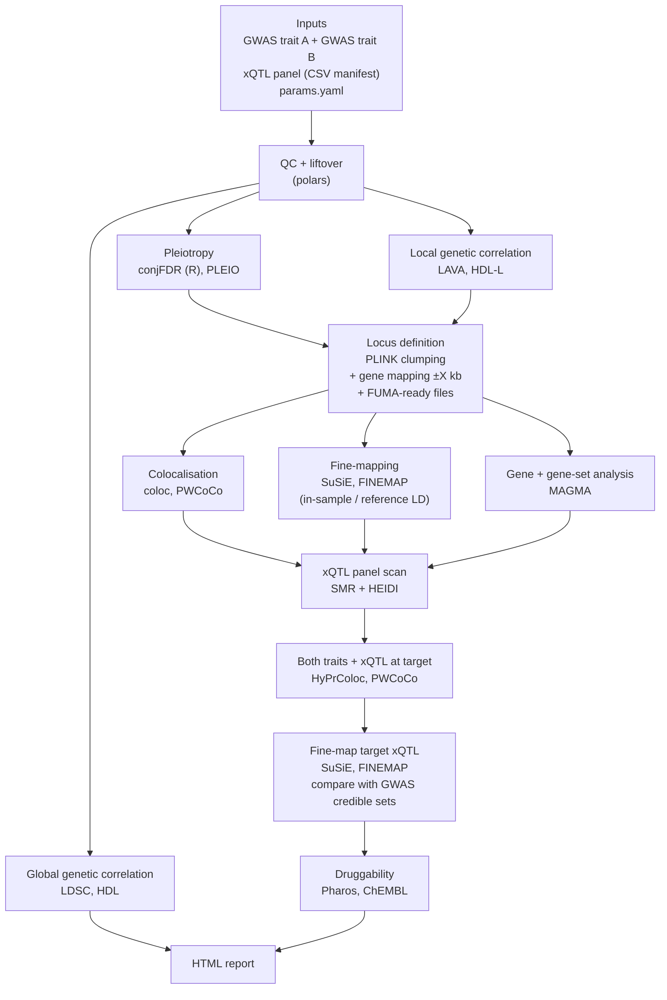

# nf-core/sherlock: pipeline schematic

```mermaid
flowchart TD
    IN["Inputs<br/>GWAS trait A + GWAS trait B<br/>xQTL panel (CSV manifest)<br/>params.yaml"]

    IN --> QC["QC + liftover<br/>(polars)"]

    QC --> GLOBAL["Global genetic correlation<br/>LDSC, HDL"]
    QC --> LOCAL["Local genetic correlation<br/>LAVA, HDL-L"]
    QC --> PLEIO["Pleiotropy<br/>conjFDR (R), PLEIO"]

    PLEIO --> LOCI["Locus definition<br/>PLINK clumping<br/>+ gene mapping ±X kb<br/>+ FUMA-ready files"]
    LOCAL --> LOCI

    LOCI --> COLOC["Colocalisation<br/>coloc, PWCoCo"]
    LOCI --> FM["Fine-mapping<br/>SuSiE, FINEMAP<br/>(in-sample / reference LD)"]
    LOCI --> MAGMA["Gene + gene-set analysis<br/>MAGMA"]

    COLOC --> SMR["xQTL panel scan<br/>SMR + HEIDI"]
    FM --> SMR
    MAGMA --> SMR

    SMR --> MULTI["Both traits + xQTL at target<br/>HyPrColoc, PWCoCo"]
    MULTI --> QTLFM["Fine-map target xQTL<br/>SuSiE, FINEMAP<br/>compare with GWAS credible sets"]

    QTLFM --> DRUG["Druggability<br/>Pharos, ChEMBL"]

    GLOBAL --> REPORT["HTML report"]
    DRUG --> REPORT
```
